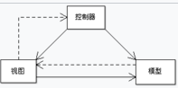
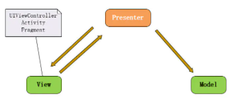

# 软件架构模式
MVC(model-view-controller)



MVP(Model View Presenter) -> RMVP(router module view controller)



MVVM
# 基础使用
``` js
const express = require('express');

const app = express()

app.use('/', (request, response) => {
  response.send('hello')
})

app.listen(8000, () => {
  console.log('监听端口8000');
})
```
app.use()  类似creatServer内部的内容
``` js
// use从上至下匹配，只匹配一个
app.use('/api', (request, response) => {
  response.send('world')
})
app.use('/', (request, response) => {
  response.send('hello')
})
```
# 中间件
## 自定义中间件
### 中间件栈
> 这里的实现顺序并不是栈的顺序，为何叫中间件栈呢？
``` js
// use从上至下匹配，只匹配一个
// 挂载多个中间件，形成多个中间件栈
app.use('/api', (request, response, next) => {
  console.log(0);
  next()
}, (request, response, next) => {
  console.log(1);
  next()
}, (req, res) => {
  res.send('hello middlewares stack')
})
//中间件栈的数组封装
const middlewares = [(request, response, next) => {
  console.log(0);
  next()
}, (request, response, next) => {
  console.log(1);
  next()
}, (req, res) => {
  res.send('hello middlewares stack')
}]
app.use('/api', middlewares)
```
### 不同路由，若是匹配也可形成中间件栈
``` js
const middlewares = [(request, response, next) => {
  console.log(0);
  next()
}, (request, response, next) => {
  console.log(1);
  next()
}, (req, res, next) => {
  next() //最后添加next(),就会去调用接下来的其他匹配路由的回调函数
}]
app.use('/api', middlewares)

app.use('/', (request, response) => { //这个也会调用
  response.send('hello')
})
```
## [路由中间件](#纯静态资源)
### 路由中获取query
``` js
// 获取query
router.get('/index', (req, res, next) => {
  const query = req.query
  console.log(query);
  res.send(query) //这里会自动添加content-type
  res.json(query) //或者直接传json
})
```
## 第三方中间件
### body-parser
Node.js body midllerware, body-parser已弃用，继承到express当中了
``` js
app.use(express.json()) //application/json
app.use(express.urlencoded({ extends: false })) //application/x-www-form-urlencoded
```
## [ 内置中间件 ](#art-template)
# router
index.js
``` js
const router = require('express').Router()


router.get('/', (req, res) => {
  res.send('home pages')
})
// 注意在router中，是精确匹配的，/index就是匹配/index,不会匹配/
router.get('/index', (req, res, next) => {
  res.send('index pages')
})

module.exports = router
```
server.js
``` js
const express = require('express');
const router = require('./router/index')

const app = express()

app.use('/', router)

app.listen(8000, () => {
  console.log('localhost:8000');
})
```
## 不同http方法的语义区别
``` js
//get 获取数据
router.get('/index', (req, res, next) => {
})
//post 增加数据
router.post('/index', (req, res, next) => {
})
// 删除数据
router.delete('/index', (req, res, next) => {
})
// 修改数据-覆盖式修改-全部改掉
router.put('/index', (req, res, next) => {
})
// 修改数据-增量修改-改一部分
router.patch('/index', (req, res, next) => {
})
//所有都接受
router.all('/index', (req, res, next) => {
  res.send('hello')
})
```
# Controller
/controller/index.js
``` js
const list = (req, res, next) => {
  const query = req.query
  console.log(query);
  res.send(query) //这里会自动添加content-type
  // res.json(query)
  next()
}

exports.list = list
```
/router/index.js
``` js
const { list } = require('../controller/index')

router.get('/index', list)
```
# View:express template
+ ejs
+ pug
+ jade
+ art-template
## 前后端交互方式
### 纯静态资源
server.js 中添加下面的一行
``` js
// 内置中间件：静态资源服务中间件,默认public中查找静态资源 。http://localhost:8000/index.html --> 会查找到 public/index.html
app.use(express.static('public'))
```
### 服务端渲染 SSR(Server Side Render)
router index.js
```js
router.get('/api/list', list)
```
controller index.js
``` js
const list = (req, res, next) => {
  let data = `<ul>`
  for (let i = 0; i < 100; i++) {
    data += `<li>this is ${i} line </li>`
  }
  data += `</ul>`
  res.send(data)
  next()
}
```
### 客户端渲染 SSR(Server Side Render)
后端提供数据，前端根据数据渲染
## art-template 模板
安装
``` js
yarn add art-template express-art-template -S
```
### 后端使用 
server.js
``` js
// art-template
app.engine('art', require('express-art-template'));
// 官网是错误的，显然这个东西没什么人维护了，github是对的
app.set('view options', {
  debug: process.env.NODE_ENV !== 'production',
  escape: false  //防止传递的数据进行编码
});
app.set('views', path.join(__dirname, 'views'));
app.set('view engine', 'art');
// 内置中间件：静态资源服务中间件
app.use(express.static('public'))
```
views/list.art 模板
``` json
{
  "ret":true,
  "data": {{dataStr}}
}
```
#### 后端渲染html
##### 后端请求带来后生成对应html，并返回
controller/index.js
``` js
  // 客户端模板渲染html
  res.render('list-html', {
    data: dataArray
  })
```
views/list-html.art
``` html
<!DOCTYPE html>
<html lang="en">
  <head>
    <meta charset="UTF-8" />
    <meta http-equiv="X-UA-Compatible" content="IE=edge" />
    <meta name="viewport" content="width=device-width, initial-scale=1.0" />
    <title>Document</title>
  </head>
  <body>
    <ul>
      {{each data}}
      <li>{{ $value }}</li>
      {{/each}}
    </ul>
  </body>
</html>

```
##### cms
后端直接生成html页面，待需返回
``` js
const template = require('art-template');
const path = require('path');
const fs = require('fs');

// 通过template渲染页面，有需要时再返回
let html = template(path.resolve(__dirname, '../views/list-html.art'), {
  data: dataArray
});
// 将生成的html写入publicc中，待需使用 此处使用与上文相同模板
fs.writeFile(path.join(__dirname, '../public/list.html'), html, (err) => {
  if (err) throw err
  console.log('文件已经被创建');
})
```
### 前端使用 

基础写法 common.js
``` js
    // 这个东西不要太像啊,vue里面的template啊
    const html = template.render('<div>{{ data }}</div>', { data: 100 })
```
扩展用法 common.js
``` js
$.ajax({
  url: '/api/list',
  success(result) {
    let templateStr = `
      <ul>
        {{each data}}
          <li>{{$value}}</li>
        {{/each}}
      </ul>
    `
    const html = template.render(templateStr, {
      data: result.data //这个数据是后端拿过来的
    })
    $('#list').html(html)
  }
})
```
## express-generator
``` js
yarn global express-generator // 全局安装express-generator
```