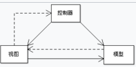
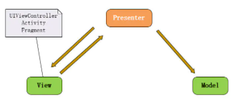

# 基础使用
``` js
const express = require('express');

const app = express()

app.use('/', (request, response) => {
  response.send('hello')
})

app.listen(8000, () => {
  console.log('监听端口8000');
})
```
app.use()  类似creatServer内部的内容
``` js
// use从上至下匹配，只匹配一个
app.use('/api', (request, response) => {
  response.send('world')
})
app.use('/', (request, response) => {
  response.send('hello')
})
```
# 中间件
## 自定义中间件
### 中间件栈
> 这里的实现顺序并不是栈的顺序，为何叫中间件栈呢？
``` js
// use从上至下匹配，只匹配一个
// 挂载多个中间件，形成多个中间件栈
app.use('/api', (request, response, next) => {
  console.log(0);
  next()
}, (request, response, next) => {
  console.log(1);
  next()
}, (req, res) => {
  res.send('hello middlewares stack')
})
//中间件栈的数组封装
const middlewares = [(request, response, next) => {
  console.log(0);
  next()
}, (request, response, next) => {
  console.log(1);
  next()
}, (req, res) => {
  res.send('hello middlewares stack')
}]
app.use('/api', middlewares)
```
### 不同路由，若是匹配也可形成中间件栈
``` js
const middlewares = [(request, response, next) => {
  console.log(0);
  next()
}, (request, response, next) => {
  console.log(1);
  next()
}, (req, res, next) => {
  next() //最后添加next(),就会去调用接下来的其他匹配路由的回调函数
}]
app.use('/api', middlewares)

app.use('/', (request, response) => { //这个也会调用
  response.send('hello')
})
```
## [路由中间件](#router)
### 路由中获取query
``` js
// 获取query
router.get('/index', (req, res, next) => {
  const query = req.query
  console.log(query);
  res.send(query) //这里会自动添加content-type
  res.json(query) //或者直接传json
})
```
## 第三方中间件
### body-parser
Node.js body midllerware, body-parser已弃用，继承到express当中了
``` js
app.use(express.json()) //application/json
app.use(express.urlencoded({ extends: false })) //application/x-www-form-urlencoded
```
# 软件架构模式
MVC(model-view-controller)



MVP(Model View Presenter)



MVVM
# router
index.js
``` js
const router = require('express').Router()


router.get('/', (req, res) => {
  res.send('home pages')
})
// 注意在router中，是精确匹配的，/index就是匹配/index,不会匹配/
router.get('/index', (req, res, next) => {
  res.send('index pages')
})

module.exports = router
```
server.js
``` js
const express = require('express');
const router = require('./router/index')

const app = express()

app.use('/', router)

app.listen(8000, () => {
  console.log('localhost:8000');
})
```
## 不同http方法的区别
``` js
//get 获取数据
router.get('/index', (req, res, next) => {
})
//post 增加数据
router.post('/index', (req, res, next) => {
})
// 删除数据
router.delete('/index', (req, res, next) => {
})
// 修改数据-覆盖式修改-全部改掉
router.put('/index', (req, res, next) => {
})
// 修改数据-增量修改-改一部分
router.patch('/index', (req, res, next) => {
})
```