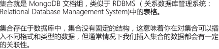

# MongoDB
## 术语

### database

### collection

### document

### MogoDB数据类型

# 安装和使用
## 安装
直接官网下载安装即可
## 使用
windows 使用命令行开启mongod
``` js
mongod --dbpath <path> //若是在文件夹内执行，可以不用<path>
``` 
mac
``` js
$ mongod --config /user/local/etc/mongod.conf
```
## 一些基础操作
### Database操作
``` js
> db //查看当前database
> help //获取帮助
> show dbs //显示所有数据库
> db < databaseName > //创建数据库
> ues < databaseName > //切换数据库
> db.stats() //查看当前数据库状态
> db.version() //version
> db.getMongo() //获取当前数据库server ip
> db.dropDatabase() //删除当前数据库
```
### Collection操作
``` js
> db.creatCollection('collectionName ')//创建集合
> db.getCollection('jay Z') //得到特定集合
> db.getCollectionNames() //得到当前所有集合
> db.printCollectionStats() //显示当前DB所有集合状态
```
### document的操作
``` js
db.wuug.insert([{name:'sing1',release:'2020-1-11'}]) //插入一个document，添加多个使用对象数组哦
db.wuug.save([{name:'sing4',release:'2020-2-32'}]) //insert的别名方法

db.wuug.find() //查看集合下的所有文档

// 修改
db.wuug.update({name:'sing1'},{$set:{release:'2222-1-1'}})
db.wuug.update({name:'sing1'},{$inc:{soldNum:180}}) //找到后进行加法处理
db.wuug.update({name:'sing10'},{$inc:{soldNum:120}},true) //第三个参数是，若没有匹配，就添加数据;   false:不添加 默认true
db.wuug.update({name:'sing1'},{$inc:{soldNum:120}},true,true) //第四个参数,匹配多个。 默认false，只匹配一个

//删除
db.wuug.remove({name:'sing2'})
```
#### document的查询操作
db.wuug内部数据


``` js
db.wuug.distinct('name') //查询所有name的所有内容，无重复
db.wuug.find({soldNum:300}) //查询所有soldNum==300的数据

db.wuug.find({release:{$gt:'2020-1-11'}}) // 查询release大于2020-1-11的数据
db.wuug.find({release:{$gte:'2020-1-11'}}) // 查询release大于等于2020-1-11的数据

db.wuug.find({release:{$lt:'2020-2-32'}}) // 查询release小于2020-2-32的数据
db.wuug.find({release:{$lte:'2020-2-32'}}) // 查询release小于等于2020-2-32的数据

db.wuug.find({release:{$gt:'2020-2-32',$lt:'2222-1-1'}}) //大于2020-2-32 小于 2222-1-1

db.wuug.find({name:/1/}) //正则查询

db.wuug.find({},{_id:0,soldNum:0}) //匹配所有，但是不显示_id和soldNum
db.wuug.find({},{_id:0,soldNum:0}).sort({release:1}) //按release排序，并升序显示(1).   降序显示(-1)
db.wuug.find({}).limit(3) //匹配后取前三条
db.wuug.find({}).limit(3).skip(3) //匹配后，跳过三条后再取前三条

// sort 无论放在什么地方 都是先排序后查找
db.wuug.find({}).limit(2).skip(2).sort({release:1})
db.wuug.find({}).limit(2).sort({release:1}).skip(2)   

db.wuug.find({$or:[{name:'sing1'},{release:'2020-2-32'},{name:'sing10'}]}) // or 查询

db.wuug.findOne() //查询第一条数据
db.wuug.find().count() //返回查询到的数据量
```
## Mongoose
帮助nodejs操作moogodb的工具
### 基础使用
#### 基础例子
``` js
//导入，并连接数据库
var mongoose = require('mongoose');
mongoose.connect('mongodb://localhost/lagou-admin', { useNewUrlParser: true, useUnifiedTopology: true });

// 添加数据库连接时的消息提示
var db = mongoose.connection;
db.on('error', console.error.bind(console, 'connection error:'));
db.once('open', function () {
  console.log('数据库连接成功！！');
});

//定义数据库document的模式
var kittySchema = mongoose.Schema({
  name: String
});
// 定义数据库Collection和对应模式
var Kitten = mongoose.model('Kitten', kittySchema)
// 使用构造函数
var mimi = new Kitten({
  name: 'mimi'
})
// 保存数据刚刚的数据
mimi.save()
```
#### user例子
db.js
``` js
//导入，并连接数据库
var mongoose = require('mongoose');
mongoose.connect('mongodb://localhost/lagou-admin', { useNewUrlParser: true, useUnifiedTopology: true });

// 添加数据库连接时的消息提示
var db = mongoose.connection;
db.on('error', console.error.bind(console, 'connection error:'));
db.once('open', function () {
  console.log('数据库连接成功！！');
});

//设置用户的Schema
var UsersSchema = mongoose.Schema({
  username: String,
  password: String
});
// 定义Colletion：users，何其对应的schema
var Users = mongoose.model('users', UsersSchema)

//导出使用
module.exports = {
  Users
}
```
models/user.js
``` js
const { Users } = require('../utils/db')

const signupModel = (username, password) => {
  const user = new Users({
    username,
    password
  })
  user.save()
}

module.exports = {
  signupModel
}
```
在controller中使用    controller/user.js
``` js
const { signupModel } = require('../models/users')

// 直接使用就好
signupModel(username, password)
```